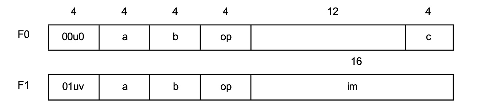
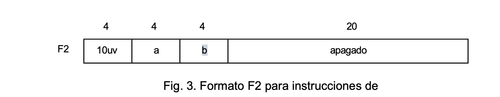
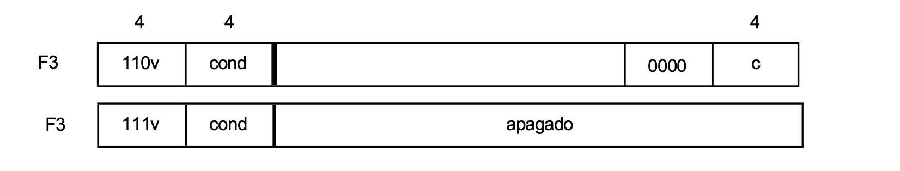

\newpage

## RISC0
Los procesadores constan de dos partes la unidad arimética lógica **ALU** y la unidad de control. La primera realiza operaciones aritméticas lógicas, mientras que la segunda controla el flujo de operaciones. Además del procesador, existe la memoria. Nuestro RISC consta de una memoria cuyos elementos direccionables individualmente son de bytes(8 bits).

La ALU cuenta con un banco de 16 registros de 32 bits. Las cantidades de 32 bits se denominan palabras. Las operaciones aritméticas y lógicas, representadas por instrucciones, siempre operan sobre estos registros. Los datos se pueden transferir entre la memoria y los registros mediante instrucciones separadas de carga y almacenamiento. 

Características importantes de las arquitecturas RISC:

1. La memoria esta en gran memdida desacoplada del procesador.
2. Cada instrucción tarda un ciclo de relój en ejecutarse, quizas con la excepción del acceso a una memoria más lenta.

### Banco de registros
En la imagen se observa como el bloque amarillo. En los procesadores RISC, casi todas las operaciones se realizan sobre sobre registros.

* **Entrada(a):** Es el canal por donde se escribre el resultado de una operación de vuelta al banco de registros.

* **Salidas(b y c):** Son los operandos que el procesador lee para realizar la operación. Por ejemplo si quieres suma R1 + R2, el valor de R1 saldría por el cable b y el del R2 del cable C.

### El Multiplexor
Antes de entrar a la ALU, vemos un selector que tiene dos entradas:

* **c:** El valor que viene directamente del banco de registros.
* **constante IR:** Un valor inmediato (un número fijo) que viene directamente de la instrucción (Instruction Register).

Permite que la ALU elija entre operar con dos registros o con un registro y un número constante.

### ALU
Es el bloque que realiza el trabajo pesado. Recibe dos datos:

* Uno viene siempre del registro a través de la linea b.
* El otro viene del multiplexor (ya sea un registro o una constante).
 
 La ALU ejecuta la operación que indique la instrucción actual.

 ### Ciclo de retroalimentación

 Notarás que la línea que sale de la parte inferior de la ALU sube de nuevo a la entrada a. Esto significa que una vez que la ALU calcula el resultado, este se envía de vuelta para guardarse en un registro destino. Asi, el resultado queda disponible para la siguiente instrucción.

 ### El conjunto de instrucciónes.

 El términio reducido sugiere que mantener el conjunto de instrucciones pequeño es buena idea. Un conjunto de instrucciones debe permitir componer cualquier operación más compleja a partir de instrucciones básicas. El segundo objetivo debe ser la regularidad, reglas directas sin excepciones.

 El prinicipal enemigo de la regularidad y la simplicidad es la búsqueda de la velocidad y la eficiencia. Damos prioridad un diseño sencillo y regular.

 La arquitectura RISC divide las instrucciones en tres clases: 

 1. Instrucciones aritméticas y Lógicas que operan sobre registros.
 2. Operaciones para transferir datos entre registros y memoria.
 3. Instrucciones de control (ramificación).

### Resgistro de instrucciones

Seguimos con la convención establecida de proporcionar instrucciones con 3 número de registro, dos que especifican los operandos (fuentes) y uno el resultado (destino). De este modo obtenemos un ordenador de 3 direcciones. Esto proporciona a los compiladores el mayor grado de libertad para asignar registros con el fin de obtener una eficiencia óptima. Las operaciones lógicas son las convencionales  AND, OR y XOR.
Las operaciones aritméticas son las cuatro operaciones básicas de suma, resta, multiplicación y división.

Además incluimos un conjunto de instrucciones de desplazamiento, que mueven los bits horizontalmente. También proporcionamos desplazamiento a la izquierda **LSL** y desplazamiento a la derecha **ASR**. El primero introduce ceros en el extremo inferior, mientras que segundo replica el bit superior en el extremo superior. El recuento de desplazamiento puede ser cualquier número entre 0 y 31.

Las 16 instrucciones de registro utilizan las mismas dos formas. En la forma F0, ambos operandos son registristros. En el formator F1, un operando es un registro y el otro es una constante contenida en la propia instrucción.

El conjunto completo  de instrucciones de registro se muestra en la siguiente tabla en un formato similar al ensamblador.

R.a es un registro de destino y R.b es el primer operando. El segundo operando es el registro R.c o el literal inmediato **im**. En este caso el bit modificador v determina como se amplia la constante de 16 bit im a un valor de 32 bits. 


### Tabla 1: Instrucciones de Registro

A continuación se detallan las 16 instrucciones de registro, su sintaxis y operación. En estas instrucciones, $R.a$ es el registro de destino, $R.b$ es el primer operando, y $n$ representa ya sea el registro $R.c$ (formato F0) o el literal inmediato $im$ (formato F1).

| Op | Mnemónico | Sintaxis | Operación | Categoría / Descripción |
|:---:|:---|:---|:---|:---|
| 0 | **MOV** | a, n | $R.a := n$ | Mover valor |
| 1 | **LSL** | a, b, n | $R.a := R.b \leftarrow n$ | Desplazamiento a la izquierda ($n$ bits) |
| 2 | **ASR** | a, b, n | $R.a := R.b \rightarrow n$ | Desplazamiento a la derecha (extensión de signo) |
| 3 | **ROR** | a, b, n | $R.a := R.b \text{ rot } n$ | Rotar a la derecha ($n$ bits) |
| 4 | **AND** | a, b, n | $R.a := R.b \ \& \ n$ | Operación lógica AND |
| 5 | **ANN** | a, b, n | $R.a := R.b \ \& \ \sim n$ | Operación lógica AND NOT |
| 6 | **IOR** | a, b, n | $R.a := R.b \text{ o } n$ | Operación lógica OR inclusivo |
| 7 | **XOR** | a, b, n | $R.a := R.b \text{ xor } n$ | Operación lógica OR exclusivo |
| 8 | **ADD** | a, b, n | $R.a := R.b + n$ | Aritmética entera: Suma |
| 9 | **SUB** | a, b, n | $R.a := R.b - n$ | Aritmética entera: Resta |
| 10 | **MUL** | a, b, n | $R.a := R.a \times n$ | Aritmética entera: Multiplicación |
| 11 | **DIV** | a, b, n | $R.a := R.b \text{ div } n$ | Aritmética entera: División |
| 12 | **FAD** | a, b, c | $R.a := R.b + R.c$ | Coma flotante: Suma |
| 13 | **FSB** | a, b, c | $R.a := R.b - R.c$ | Coma flotante: Resta |
| 14 | **FML** | a, b, c | $R.a := R.a \times R.c$ | Coma flotante: Multiplicación |
| 15 | **FDV** | a, b, c | $R.a := R.b / R.c$ | Coma flotante: División |

---

### Notas sobre los operandos:
* **F0 (Registro-Registro):** El operando $n$ corresponde a los bits del registro $R.c$.
* **F1 (Registro-Inmediato):** El operando $n$ corresponde al valor constante $im$ (16 bits) extendido según el bit modificador $v$.



### Instruciones de memoria

Solo hay dos instrucciones de memoria, cargar y almacenar. Especificar un registro de destino R.a para la carga, o un registro de origen para el almacenamiento. La dirección de memoria es la suma del registro R.b y un desplazamiento de 20 bits. 

* LD a, b, off    R.a := Mem[R.b + off]
* ST a, b, off    Mem[R.b + off] := R.a 

**u(Dirección del dato):** 

* $u = 0$ Operación con carga (Memoria $\to$ Registro).
 
* $u = 1$ Operación con almacenamiento (Registro $\to$ Memoria).

**v(Tamaño del dato):** 

* $v = 0$ Se transifere una palabra completa (32 bits).
 
* $v = 1$ Se transfiere solo un byte (8 bits). (RISC3)

Para calcular la dirección de memoria, el procesador no busca una dirección fija, sino que la calcula dinámicamente. Esto se llama direccionamiento indexado.



### Instruciones de bifurcación

Las instrucciones de ramificación se utilizan para romper la secuencia de instrucciones. La siguiente instrucción se designa mediante un desplazamiento con signo de 24 bits o mediante el valor de un registro, dependiendo del bit modificador u. Indica la longitud del salto hacia adelante o hacia atras(direccionamiento relativo al PC). Este desplazamiento se expresa en palabras, no en bytes, ya que las instrucciones siempre tienen una longitud de una palabra.

El modificador v determina si el valor del PC se almacena en el R15(registro de enlace). Esta función se utiliza para llamadas a procedimientos. El valor almacenado es entonces la dirección de retorno.

**U** 

* $u = 0$ Salto por registro, se usa cuando ya tienes la dirección de destino guardada en un registro (normalmente porque vas a regresar de una función) $PC := RC$.
 
* $u = 1$ Salto relativo es el que se usa para los if y los bucles (for, while), no le das una dirección exacta sino una distancia $PC :=  PC + 1 + offset$ (Como el offset tienen 24 bits y es con signo puedes saltar hasta 8 millones de instrucciones hacia arriba o hacia abajo).

**V:** 

* $v = 1$ El registro de enlace, antes de saltar a otro lado guarda en el registro R15 la dirección de la instrucción que sigue a esta $R15 := PC + 1$ (Para que cunado termine la función solo tenga que hacer una salto a R15 para regresar a la instrucción).
 
* $v = 1$ Se transfiere solo un byte (8 bits). (RISC3)

Para calcular la dirección de memoria, el procesador no busca una dirección fija, sino que la calcula dinámicamente. Esto se llama direccionamiento indexado.

### Tabla de Condiciones (Campo `cond`)

Las instrucciones de bifurcación (Formato F3) utilizan un campo de 4 bits para determinar si el salto debe ejecutarse. Esta decisión se basa en el estado actual de las banderas de la ALU ($N, Z, C, V$).

| Código | Mnemónico | Condición | Lógica de Banderas |
|:---:|:---:|:---|:---:|
| 0000 | **MI** | Negativo (*Minus*) | $N$ |
| 0001 | **EQ** | Igual (*Equal* / Cero) | $Z$ |
| 0010 | **CS** | Llevar establecido (*Carry Set*) | $C$ |
| 0011 | **VS** | Desbordamiento establecido (*Overflow Set*) | $V$ |
| 1000 | **PL** | Positivo (*Plus*) | $\sim N$ |
| 1001 | **NE** | No igual (*Not Equal* / No cero) | $\sim Z$ |
| 1010 | **CC** | Llevar borrado (*Carry Clear*) | $\sim C$ |
| 1011 | **VC** | Desbordamiento borrado (*Overflow Clear*) | $\sim V$ |

---

### Observación Técnica sobre las Banderas
Las condiciones se evalúan inmediatamente después de que una instrucción aritmética o lógica (como `SUB`, `ADD` o `CMP`) actualiza los registros de estado:

* **$N$ (Negative):** Se activa si el bit más significativo del resultado es 1.
* **$Z$ (Zero):** Se activa si todos los bits del resultado son 0.
* **$C$ (Carry):** Se activa si hay un acarreo fuera del bit más significativo.
* **$V$ (Overflow):** Se activa si el resultado excede el rango de representación con signo.

> **Nota:** En la documentación original, el código `1001 (NE)` a veces aparece con la descripción "positivo", pero técnicamente representa la condición **No Igual** ($\sim Z$), que es la inversa de **EQ**.



---


## Seis posibles optimizaciones de la caché

### **Bloques grander para reducir las fallas**

Esta es la optimización más sencilla, se toma ventaja de la localidad espacial y se incrementa el tamaño de bloque. Bloques grandes reducen los fallos obligatorios, pero también se incrementa la penalizaciópn de fallos. Debido a que bloques grandes reducen el número de etiquetas, se pueden reducir un poco la potencia estática. Los bloques grandes también aumentan la capacidad o fallas de conflicto, especialmente en cachés pequeñas. Escoger el tamaño de bloque es un compromiso complejo que depende del tamaño del caché y el número de fallos.

### **Cache grandes para reducir el número de fallos**

El camino obvio para reducir el número de fallos de capacidad es incrementar la capacidad de la caché. Inconvenientes incluyen potencialmente tiempos de éxito para la memoria caché mas grades, más costos y potencia eléctrica. Cachés grandes incrementan tanto la potencia estática como la dinámica.

### **Asociatividad más grande para reucir el número de fallos**

Obviamente, al incrementar la asociatividad reduce los fallos de conflicto. Asociatividad más grande puede venir al costo de incrementar el timpo de éxito, la asocitividad también puede incrementar el consumo de potencia.


### **Cachés multinivel para reducir la penalización de fallos**

Una decisión dificil es donde hacer el tiempo de éxito rápido, para mantener el alto ciclo de relój de los procesadore o hacer la caché más grande para reducir la separación entre los accesos al procesador y los accesos a la memoria principal. Adicionar otro nivel n a la caché entre la caché original y la memoria simplica la decisión. El primer nivel de la caché puede se lo suficientemente pequeña ára un timpo de ciclo de relój; rápido, y el segundo nivel (o el tercero) puede ser lo suficientemente grande para capturar muchos accesos que podrían ir a la memoria principal. Poner el foco en los fallos secundarios de cache resulta en bloques grandes, mayor capacidad y asociatividad más alta.

Cachés multinivel son más eficientes en cosumo de potencia que una ruta caché. Si L1 y L2 se definen como los niveles primario y secundario de la caché, respectivamente, el tiempo promedio de acceso a memoria sería.

$$
Tiempo promedio de acceso a memoria = Tiempo de éxito L1 + Razoón de fallos L1 * (Tiempo de exito L2 + Razón de fallos L2 * Penalización de fallos L2)
$$

Todos los procesadores actuales usan cachés multinivel, tipicamente con dos o tres niveles. Los compromisos en el diseño pueden ser diferentes para diferentes niveles de caché debido al deseo de optimizar ya que el tiempo de éxito o el tiempo de falla. Por ejemplo que el tiempo de éxito de L1 es crítico, el rendimiento es menos sensible o un pequeño incremento en el tiempo de éxito en el último nivel de la caché (UNC, que puede ser L2 o L3). Aún más, la penalización de fallos para la UNC es típicamente mayor que para L1, por lo tanto una optimnización que podría ser muy costosa para Lq puede tener sentido para UNC.

### **Dar prioridad a los fallos de lectura sobre los de escritura para reducir las penalización de fallos**

Un bufer de escritura es un buen lugar para implementar esta solución. Buferes de escritura crean peligros porque deben de mantener el valor actualizado de una localidad necesaria sobre un fallo de lectura - esto es, **un peligro de lectura** después de una escritura o a través de la memoria. Una solución es checar el contenido del bufer de escritura sobre una falla de lectura. Si no hay conflictos y si el sistema de memoría está disponible, se envía antes la lectura que la escritura, esto reduce la penalización de fallas.

La mayoría de los procesadores tienen la prioridad de lectura sobre la escritura. Este cambio tiene muy pco efecnto en el cosumo de potencia.

### **Rechazar traduccion de direcciones durante el indizado de la caché para reucir el tiempo de éxito**

Las cachés deben de tratar con la traducción de una dirección virutal del procesador a la dirección física para accesar a la memoria.
Una optimización común es usar el offset de la página (la parte que es idéntica en ambas direcciones virtual y física) para indezar la caché.

Este método indice virtual / etiqueta física introduce algunas complicaciones al sistema y/o limitaciones al tamaño y la estructura de la caché L1, pero la ventaja de remover el acceso al búfer de traducción desde el camino crítico sobrepsa las desventajas. Incementar la asociativiad de la caché L1 puede prevenir también este problema, ya que reduce el número de bits necesarios para indezar la caché. Esta aproximación se usa en los procesadores ARM e Intel.

Notese que cada una de estas optimizaciones tiene una potencial desventaja que pueda resultar en incrementar, mas que decrementar, el tiempo de acceso promedio a memoria.

### Note

Un programa guardado en disco debe guardarse en bloques de tamaño

$$
\begin{aligned}
2^9 &= 512 \\
2^{10} &= 1024 \\
2^{11} &= 2048
\end{aligned}
$$

Todos estos tamaños de bloques son potencias de 2 y por lo tanto múltiplos de 4; los programas están alineados.

En memoria, el sistema operativo reserva también bloques de memoria.  
¿También son múltiplos de 4?

---

## Paralelización

1. Un procesador tiene una dirección de memoria de 32 bits (esto es, direcciones de 32 bits)
La memoria está repartida en bloques de 32 bytes cada uno. La computadora tiene también una caché capaz. La computadora tiene también una caché capaz de alamacenar 16 kbytes.

a) ¿Cuántos bloques puede almacenar la cache?


$$
\begin{aligned}
\text{Total bloques} &= \frac{16 \text{ KiB}}{32 \text{ bytes/bloque}} \\
&= \frac{2^{14} \text{ bytes}}{2^5 \text{ bytes/bloque}} \\
&= 2^{14 - 5} \text{ bloques} \\
&= 512 \text{ bloques}
\end{aligned}
$$

b) Asumiendo que la caché tiene un mapeo directo, ¿Cuántos bits hay en la etiqueta, bloque y offset en cada campo de la dirección? 

* La dirección es de 32 bits 
* 512 bloques = $2^9$ 
* cada bloque es de 32 bytes = $2^5$

| Etiqueta | Bloque | Offset |
|----------|--------|--------|
| A31-A15  | A14-A5    | A4-A0   |
| 18 bits  | 9 bits   | 5 bits   |

c) Asumiendo que la cache tiene un mapeo de 4 vías, ¿cuántos bits hay en la etiqueta, en el conjunto y en el offset de las direcciones a memoria?

* Son 32 bits en las direcciones de memoria 
* Tenemos bloques de 512 bytes = $2^9 \text{ bytes}$

$$
\text{Conjunto } \frac{2^9 \text{ bytes}}{2^2} = 2^7 \text{ bytes/conjunto}
$$

Tenemos direcciones de 7 bits para el conjuntos.

| Etiqueta | Bloque | Offset |
|----------|--------|--------|
| A31-A13  | A12-A5    | A4-A0   |
| 20 bits  | 7 bits   | 5 bits   |

2. Un procesador tiene direcciones de memoria de 36 bits. La memoria está compuesta por bloques de 64 bytes. La computadora tiene también una caché de tamaño $1 \text{ MByte}$

a) ¿Cuántos bloques puede almacenar la caché?

$$
\begin{aligned}
\frac{1 \text{ MiB}}{64 \text{ bytes/bloque}} &= \frac{2^{20}}{2^6} \text{ Bloques} \\
&= 2^{14} \text{ bloques} \\
\\
1 \text{ KiB} &= 2^{10} \\
1 \text{ MiB} &= 2^{20} \\
2^{14} = 2^4 \cdot 2^{10} &= 16 \text{ Kbloques}
\end{aligned}
$$

b) Asumiendo que se tiene un mapeo directo, ¿cuántos bits se tienen para los campos de la etiqueta, bloque y offset en las direcciones de memoria?

* Direcciones 36 bits
* Bloques de 64 bytes = $2^6$ bytes

$$
\text{Mapeo directo } \frac{2^{14} \text{ bloques}}{1} = 2^{14} \text{ bloques}
$$

| Etiqueta | Bloque | Offset |
|----------|--------|--------|
| A35-A20  | A19-A6    | A5-A0   |
| 24 bits  | 14 bits   | 6 bits   |

c) Asumiendo que se tiene un conjunto con asociatividad de 8 vías ¿Cuántos bits hay en los campos de etiqueta, conjunto y offset?

$$
\text{Asociatividad de 8 vias } \frac{2^{14} \text{ bloques}}{2^4} = 2^{10} 
$$

| Etiqueta | Bloque | Offset |
|----------|--------|--------|
| A35-A16  | A15-A6    | A5-A0   |
| 20 bits  | 10 bits   | 6 bits   |

Se tenían programas que se ejecutan en un solo procesador.

A través de los años se han creado ideas para aprovechar la parelización.

**Paralelización en hardware**

* Instrucciones vectoriales
* Paralelismo a hilo de instrucciones
* Multicore
* GPUS

**En software**

* Paralelizar "a mano"
* Usar técnias matemáticas con el compilador.

### Operación vectorial suma con acarreo en el RISC-V

* v adc.vvm vector-vector
* v adc.vxm vector-registro
* v adc.vim vector-inmediato

En el RISC-V los registros se identifican como x0, x1, ..., x3

Operaciones vectoriales con instrucciones lógicas en bits AND, OR, XOR
Op. vectoriales de corrimiento.

---

## Paralelismo a nivel de instrucciones
Esto es la cantidad de paralelismo disponible dentro de un bloque básico, sin saltos.

La forma más sencilla de explotar el PNI es explotar el paralelismo entre iteraciones en un ciclo. A esto se le llama paralelismo a nivel de ciclo.

La suma de dos arreglos de 1000 elementos 

``` C
for( i=0; i <= 999; i++)
    x[i] = x[i] + y[i];
```

Se prodrian usar instrucciones vectoriales. El punto aqui es como explotar el paralelismos sin estas instrucciones.

**Los ciclos son entre el 15% y 25% de un programa**

Cada iteración dentro del ciclo se puede sobrelapar con otra iteración, aunque dentro de cada itración existe una pequeña o no oportunidades para sobrelapar instrucciones.

Basicamente todas las tecnicas trabajan desarrollando el ciclo, ya sea estáticamente por el compilador o dinámicamente por el hardware.

### Dependencia de datos y peligros (hazards)

Determinar la dependencia de datos es crítco para determinar el grado de paralelismo que existe en un programa y como ese paralelismo puede ser explotado.

Si dos instrucciones son independientes, entonces se puede ejecutar simultaneamente en una tuberia de tamaño arbitrario sin causar ningún paro, asumiendo que la tubera tiene recursos necesarios. Si dos instrucciones son dependientes entonces deben ejecutarse en orden aunque puedan estar parcialmente sobrelapadas.

### Dependencia de datos

* Dependencia de datos
* Dependencia de nombres
* Dependencia de control

Una instrucción $j$ es "dependiente de datos" sobre una instrucción precedente $i$ si se cumple cualquiera de los siguientes dos casos:

* La instrucción $i$ produce datos que pueden ser utilizados por la instrucción $j$.

* La instrucción $j$ es dependiente de datos de una instrucción $k$, y la instrucción $k$ es dependiente de datos de una instrucción $i$.

Una dependencia dentro de una instrucción como 

```ASM
add x0 x0 x0
```

no se considera dependencia.

Código en RISC-V

```ASM
fld  f0, (0)x1    // f0: elemento del arreglo
fadd f4, f0, f2   // suma escalar con f2
fsd  f4, 0(x1)    // almacena el resultado
addi x1, x1, -8   // decrementa un puntero
bne  x1, x2, Loop // salto si x1 != x2
```

Existen dos dependencias de dato, una en punto flotante

```ASM
Loop:
    fld  f0, (0)x1
    fadd f4, f0, f2
    fsd  f4, 0(x1)
```

y una dependencia en enteros

```ASM
addi x1, x1, -8
bne  x1, x2, Loop
```
La dependencia es una propiedad de los "programas."

Donde en una dependencia dada resulta en un peligro actual que se detecte y donde el peligro actual causa un paro son propiedades de "la organización de la tuberia."

Una dependencia cubre tres casos

1) La posibilidad de un peligro
2) el orden en que los resultados deben ser calculados y
3) el límite superior en que tanto paralelismo puede ser posiblemente explotado.

Una dependencia se puede superar de dos formas

1) Manteniedo la dependencia pero superando el peligro
2) eliminando la dependencia modificando el código.

El despacho de código es el método primario usado para evitar el peligro sin alterar la dependencia, y este despacho puede hacerse por el compilador o por el hardware.

La dependencia de datos entre registros es fácil de detectar.

La dependencia de datos entre localidad de memoria ya no es fácil, debido a que existen varias maneras de representar una localidad. Estas son las dependencias de nombre.

| Instrucción| Instrucción que usa el resultado | Latencia de ciclos de relój|
|---------------------|---------------------|---------------------|
| op PF ALU   | Otra op PF ALU              | 3    |
| op PF ALU   | Almacena doble              |  2    |
| Carga doble | op PF ALU                   | 1   |
| Carga doble | Almacena doble              | 0   |

La tercera columna indica cuantos ciclos de relój; debe de ejecutarse para obtener el resultado

``` ASM
Loop:
    fld  f0, (0)x1      1
    Paro                2
    fadd f4, f0, f2     3
    Paro                4
    Paro                5
    fsd f4, 0(x1)       6
    addi x1, x1, -8     7
    bne x1, x2, Loop    8
```

Reducción en un ciclo de relój y obtenemnos 7 ciclos por cada elemento del arreglo:

``` ASM
Loop:
    fld  f0, (0)x1      1
    addi x1, x1, -8     2
    bne x1, x2, Loop    3
    fadd f4, f0, f2     4
    Paro                5
    Paro                6
    fsd f4, 0(x1)       7
```

Podriamos desdoblar el ciclo y suponiendo que arreglo es de tamaño múltiplo de cuatro, nos ahorrarieamos 3 instrucciones bne.

```C
for( i = 999; i >= 0; i -= 4) {
    x[i] = x[i] + 5;
    x[i+1] = x[i+1] + 5;
    x[i+2] = x[i+2] + 5;
    x[i+3] = x[i+3] + 5;
}
```


``` ASM
Loop:
    fld  f0, (0)x1      
    fld  f6, (-8)x1      
    fld  f10, (-16)x1      
    fld  f14, (-24)x1      

    fadd.d  f4, f0, f2     
    fadd.d  f4, f6, f2       
    fadd.d  f12, f10, f2        
    fadd.f  f16, f14, f2     

    fsd  f4,  0(x1)     
    fsd  f8,  -8(x1)  
    fsd  f12, -16(x1)  
    fsd  f16, -24(x1)  

    addi x1, x1, -32     
    bne x1, x2, Loop     

```
