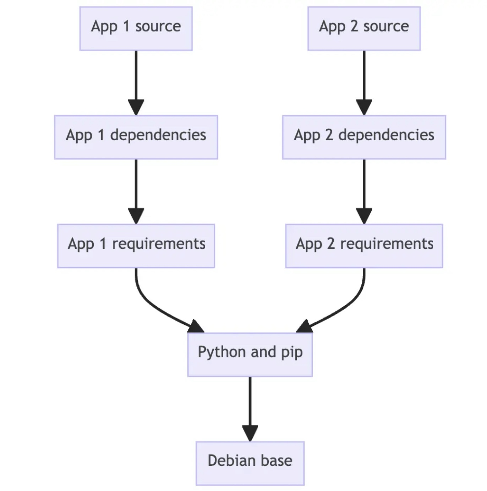

# Glosario de términos

* **Docker:**

    Docker es una herramienta diseñada para facilitar la creación, implementación y ejecución de aplicaciones mediante el uso de contenedores.

* **Container (Contenedor):**

    Es una instancia de una imagen ejecutandose en un ambiente aislado.

* **Image (Imagen):**

    Es una archivo construido por capas, que contiene todas las dependencias para ejecutarse, tal como: configuraciones, scripts, archivos binarios, etc.

* **Dockerizar una aplicación:**
    
    Proceso de tomar un código fuente y generar una imagen lista para montar y correrla en un contenedor.

* **Dockerfile:**

    Un archivo de texto con instrucciones necesarias para crear una imagen. Se puede ver como un blueprint o plano de construcción.

* **.dockerignore:**

    Similar a .gitignore, el .dockerignore especifica todo lo que hay que ignorar en un proceso de construcción (build)

* **docker-compose.yml:**

    Archivo para definir los servicios y con un solo comando en lugar de definir todo directamente en la consola.

* **Volumenes:**

    Proporcionan la capacidad de conectar rutas específicas del sistema de archivos del contenedor a la máquina host.

    Si se monta un directorio en el contenedor, los cambios en ese directorio también se ven en la máquina host.

* **Alpine - Linux:**

    Alpine Linux es una distribución de Linux ligera y orientada a la seguridad basada en musl libc y busybox.

* **Nginx:**

    Es un servidor web que también se puede utilizar como proxy inverso, balanceador de carga, proxy de correo y caché HTTP. Nginx es un software gratuito y de código abierto.

* **Container Orchestration:**

    La orquestación de contenedores es la automatización de gran parte del esfuerzo operativo requerido para ejecutar cargas de trabajo y servicios en contenedores. Ejemplos de herramientas de orquestación son Kubernetes, Swarm, Nomad y ECS.

* **Docker Layers - Capas:**

    Las capas son el resultado de la forma en que se construyen las imagenes en Docker. Cada paso en un Dockerfile crea una nueva **capa** que es esencialmente una diferencia de los cambios en el sistema de archivos desde el último paso.

* **Snyk:**

    Es una plataforma de seguridad para desarrolladores para proteger el código, las dependencias, los contenedores y la infraestructura como código.

* **Registry - Registro:**

    Es una aplicación del lado servidor altamente escalable y sin estado que almacena y le permite distribuir imágenes de Docker.

* **Docker Deamon:**

    Es el servicio en segundo plano que se ejecuta en el host que administra la creación, ejecución y distribución de contenedores Docker.


# ¿Qué es Docker?

Docker nos permite manejar imagenes y montarlas en un contenedor aislado sin importar en que sistema operativo se este trabajando Docker se asegura de que va a funcionar exactamente igual en cada uno de estos sistemas operativos.

**Beneficios:**

* Cada contenedor está aislado de los demás.

* Es posible ejecutar varias instancias de la misma versión o diferentes versiones sin configuraciones adicionales.

* Con un comando, puedes descargar, levantar y correr todo lo que necesitas.

* Cada contenedor contiene todo lo que necesita para ejecutarse.

* Indiferente del sistema operativo HOST.

# Hola mundo en Docker

## docker pull
Este comando sirve para obtener o jalar una imagen.

```bash
docker pull <image_name>
docker pull <image_name>:<TAG>
```

## correr un contenedor

```bash
docker container run <image_name>
```
## Listar contenedores e imágenes

```bash
#Contenedores
docker container ls
docker container ls -a 
```

```bash
#imagenes
docker image ls
```

## borrar contenedores e imágenes

```bash
#Contenedores
docker container rm <id_container>
docker container prune
```

```bash
#Imagenes
docker image rm <id_mage>
```
# Variables de entorno

Son valores configurables que se le pasan a un programa cuando se ejecuta.

Sirven para: 

* Configurar comportamiento.
* Evitar "hardcodear" datos (como contraseñas).
* Hacer contenedores más flexibles.

En docker, las variables de entorno se pasan con la opción: 


```bash
-e <NAME>=VALUE
```

Podemos ver un ejemplo para el siguiente comando, en el cual se utiliza la variable de entorno POSTGRES_PASSWORD.

```bash
docker container run \
  --name some-postgres \
  -e POSTGRES_PASSWORD=mysecretpassword \
  -d postgres
```

# Logs del contenedor

Es información que la imagen de nuestro contenedor esta emitiendo.
Para mostra los logs de un contenedo hay que ejecutar el siguiente comando.

```bash
docker container logs <container_id>
docker container logs --follow <container_id>
```

**--follow.** Muestra los nuevos logs que se vayan generando.

# Volumenes y Redes

Para persistir la información de que se graba en los contenedores y la vamos a reflejar en otro lugar que llamamos volumenes.

# Tipos de volumenes

## Anonymus Volumes.

Docker le asigna un nombre único a un volumen.

## Named Volumes.

Nosotros asignamos el nombre al volumen.

```bash
docker volume create todo-db #Crear un nuevo volumen 
docker volume ls #Listar volumenes creados
docker volume inspect todo-db #Inspeccionar el volumen específico
docker volume prune #Remueve todos los volumenes no usados
docker volume rm <valome_name> #Elimina un volumen especificado
docker run -v todo-db:/etc/todos getting started #Usar un volumen al correr un contenedor
```


## Bind Volumes

Sirven principalmente cuando ustedes quieren hacer una conexión o vincular, por ejemplo un file system de su equipo con un file system propiamente dentro del contenedor.

# Redes de contenedores

```bash
docker network create world-app #Crear una red
docker network connect <network_id> <container_id> #Ingresa un contenedor a la red
```

# Bind Volumes

Nos van a permitir tener nuestra aplicación, esto será una aplicación local, nuestro código fuente, conectar esta misma aplicación directamente. Esto va a ser nuestra aplicación en el contenedor que va a estar corriendo un Linux.

# Docker files

Son instrucciones de como construir capas, estas capas son por ejemplo crear un directorio, definir un puerto, copiar archivo, ejecuta un comando de linux. Son las instrucciones de como construir la imagen.

El docker file son instrucciones que indican como construir la imagen que va ejecutar la aplicación. Por lo que tenemos que dockerizar nuestro programa, lo cual consiste en tomar nuestro código fuente y empaquetarlo en una imagen.

# Building images

# Understanding the image layers

Container images are composed of layers. And each of these layers, once created, are immutable.

## Image Layers
Each layer in an image contains a set of filesystem changes - addition, deletions, or modificaction.

1. The first layer adds basic commands and a package manager, such as apt.
2. The secon layer install a Python runtime and pip for dependency management.
3. The third layer copies in an application specific requirements.txt file.
4. The fourth layer installs that application's specific dependencies.
5. The fifth layer copies in the actual source code of the applicaction.

This is benefical because it allows layers to be reused between images. For example.



## Stacking the layers

Layering is made possible by content-addressable storage and union filesystems. While this will get technical, here's how it works:

1. After each layer is downloaded, it is extracted into its own directory on the host filesystem.

2. When you run a container from an image, a union filesystem is created where layers are stacked on top of each other, creating a new and unified vieww.

3. When the container starts, its root directory is set to the location of this unified directory, usin chroot.

When the union filesystem is created, in addition to the image layers, a directory is created specifically for the running container. This allows the container to make filesystem changes while allowign the original image layer to remain untouched.

## Try it out

We are going to create a new image layer manually using the docker container commit command. The normal way to create images is using Dockerfile. But, it makes it easier to understand how it's all working.

## Create a base image

In this first step, you will create your own base image that you will then use for the following steps.

1. In a terminal, run the following command to start a new container:

```bash
docker run --name=base-container -ti ubuntu
```
Once the image has been downloaded and the container has started, you should see a new shell prompt. This is running inside your container.

2. Inside the container, run the following command to install Node.js

```bash
apt update && apt install -y node.js
```

In the context of the union filesystem, these filesystes changes occur within the directory unique to this container.

Now that Node it is installed, you are ready to save the changes you have made as a new image layer, from which you can start a new container or build new images. To do so, you will use **docker container commit** command. Run the followin command in a new terminal.

```bash
docker container commit -m "Add node" base-container node-base
```

3. View the layers of your image using the docker image history command:

```bash
docker image history node-base
```

4. To prove your image has Node installed, you can start a new container using this new image:

```bash
docker run node-base node -e "console.log('Hello again')"
```

5. Now that you are done creating your base image, you can remove that container.

## Base image definition

A base image is a foundation for building other images. It´s possible to use any images as a base image. However, some images are intentionally created as building blocks, providing a foundation or starting point for an application.

## Build and app image

1. Start a new container using the newly created node-base image:

```bash
docker run --name=app-container -ti node-base
```

2. Inside this container, run the following command to create a Node program:

```bash
echo 'console.log("Hello from an app")' > app.js
```

3. In another terminal, run the following command to save this container's changes as a new image.

```bash
docker container commit -c "CMD node app.js" -m "Add app" app-container sample-app
```

4. In a terminal outside of the container, run the following command to view the updated layer

```bash
docker image history sample-app
```

5. Finally start a new container using the brand new image. Since you specified de default command, you can use the following command.

```bash
docker run sample-app
```

# Docker file

A docker file is a text-based document that's used to create a container image. It provides instruction to the image builder on the commands to run, files to copy, startup command, and more.

As an example, the following Dockerfile would produce a ready-to-run Python application:

```bash
FROM python:3.13
WORKDIR /usr/local/app

# Install the application dependencies
COPY requirements.txt ./
RUN pip install --no-cache-dir -r requirements.txt

# Copy in the source code
COPY src ./src
EXPOSE 8080

# Setup an app user so the container doesn't run as the root user
RUN useradd app
USER app

CMD ["uvicorn", "app.main:app", "--host", "0.0.0.0", "--port", "8080"]
```

## Common instruction

* **FROM \text{<image>}** - This specifies the base image that the build will extend.

* **WORKDIR \text{<path>}** - This instruction specifies the "working directory" or the path in the image where files will be copied and commands will be executed.

* **COPY \text{<host-path> <image-path>}** - This instruction tells the builder to copy files from the host and put them into the container image.

* **RUN \text{<command>}** - This instruction tells the builder to run the specific command.

* **ENV \text{name} \text{<value>}** - This instruction set and environment variable that a running container will use.

* **EXPOSE \text{<port-number>}** - This instruction set configuration on the image that indicates a port the image would like to expose.

* **EXPOSE \text{<user-or-uid>}** - This instruction sets the default user for all subsequent instructions.

* **CMD \text{["<command>", "<arg1>"]}** - This instruction sets the defaul command a container using this image will run. 