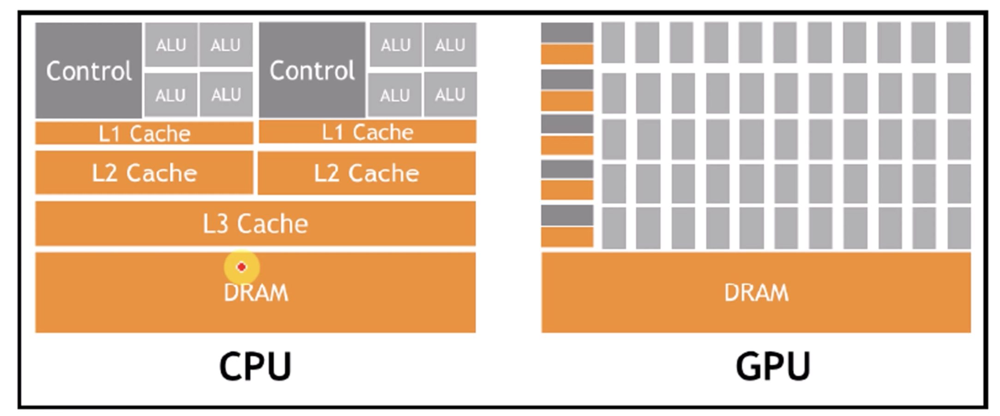
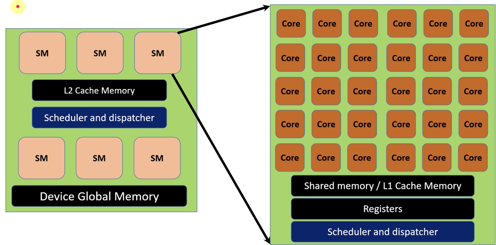
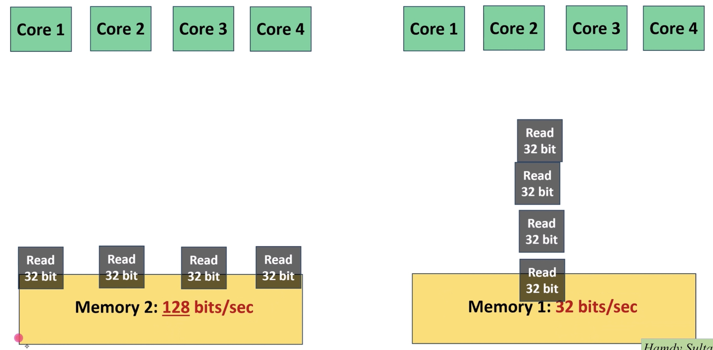

---
title: "Introducción a las GPUs Nvidia"
format: pdf
---

# Introducción a la arquitectura de una GPU

Para desbloquear el potencial completo de una GPU, es necesario conocer la arquitectura del Hardware. El enfoque de este documento tiene de propuesta conocer la Arquitectura de Hardware de las GPUs.

## GPU vs CPU

| CPU| GPU |
|--------------|----------------|
| ALU con gran capacidad | Miles de pequeñas ALUs (Cores) |
| Cache de memoria grande por ALU | Caches pequeñas por core |
| Ideal para aplicaciones secuenciales | Ideal para aplicaciones paralelizables |




## GPU hardware en general

* *Streaming Multiprocessor(SM)*
* *Niveles de memoria (L2 cache y Device Global Memory) *
* Scheduler and Dispatcher

Dentro del Streaming Multiprocessor se encuentrar una gran cantidad de cores, diseñador para tareas específicas. Algunos cores estan dedicados para ejecutar operaciones de punto flotante y otro para ejecutar operaciones con enteros.



## GPU arquitectura

* **Definición:** Diseño y estructura
* La arquitectura determina la eficiencia y performance.
* Nombre de las Arquitecturas (Nombres de científicos).

## Categorias

Existen dos categorías

### Estandar
Para usuarios normales, comprende las generaciones: 

* **Tegra**
* **Geforce**
* **Quadro**

Por ejemplo RTX xxxx (3090)

### HPC GPUs
Computo de alto redimiento.

* **Tesla**

Por ejemplo H100, A100, V100.

El término **Generación** se refiere al uso específico de la GPU, en cambio el término **Arquitectura** se refiere al diseño del Chip de las capacidades de la GPU, una arquitectura puede contener más de una generación.

## Principales parámetros que impactan el performance en GPUs

* Ancho de banda de Memoria (memory speed + bus width).
* Rendimiento de TFlops. (Numero de cores + Velocidad).
* Nuevas funcionalidades. (Soporte de nuevos tipos de datos - tensor cores).

## Memory Bandwidth
Se refiere a cuanta información puede procesar la memoria por segundo (GBs)

En la imagene podemos observar que ambas arquitecturas poseen el mismo numero de cores, pero la memoria dos tiene cuatro veces mas capacidad de realizar las operaciones de lectura y escritura que la memoria uno, por lo que si los cuatros cores requieren leer 32 bits una realizara la operación en un segundo mientras que la que solo su memory bandwidth es de 32 bits por segundo requiere de 4 segundos.



## Rendimiento de TFlops
El rendimiento en TFlop se refiere al número total de instrucciones por segundo que son ejecutadas por el GPU completo.

Un mayor número de cores se traduce en incrementar la capacidad de procesamiento paralelo. Aunque un mayor número de cores no implica que se realice más rapido un tarea ya que hay otro factor importante **core speed**.

## CUDA Compiler (nvcc)

El compilador nvcc es la clave para transformar código de alto nivel en una forma que la GPU entiende. Convierte aplicaciones CUDA en PTX Code que es compatible con varias arquitecturas de GPU.

## Librerias de CUDA
Estás libreras estan diseñadas para optimizar las operaciones significativamente.

* **cuBLAS:** GPU-accecelerated Basic Linear-Algebra subprograms.
* **cuFFT:** Fast Fourier Transform library GPUs.
* **cuRAND:** Random Numero Generation library.
* **cuDNN:** Deep Neural Network libray used for deep learning applicactions.

## CUDA Runtime and Driver APIs
Provee interfaces de bajo y alto nivel para manejar, dispositivos, memoria y ejecución del programa en el GPU.

* **cudaMalloc():** Para transferencia de datos entre el CPU y el GPU, usamos esta función. De esta forma nosotros disponemos de la memoria del GPU.

* **cudaMemcpy():** Utilizada para copiar información entre el host (CPU) y la GPU, ya sea de la GPU a CPU o de la CPU a la GPU.

# Herramientas de NVIDIA para DEBUGGING y Performance Analysis:
EL toolkit de NVIDIA incluye herramientas como :

* **NVIDIA Nsight System:** For system-wide performance analysis.
* **NVIDIA Nsight Compute:** For detailed CUDA kernel profiling and analysis.
* **CUDA-GDB:** The NVIDIA tool for debugging CUDA applications on linux and Mac OS.

* **CUDA-MEMCHECK:** Tool to detect and diagnose memory errors in CUDA applications.

Repositorio del curso de CUDA:  
https://github.com/hamdysoltan/CUDA_Course


```Python
print("hola mundo")