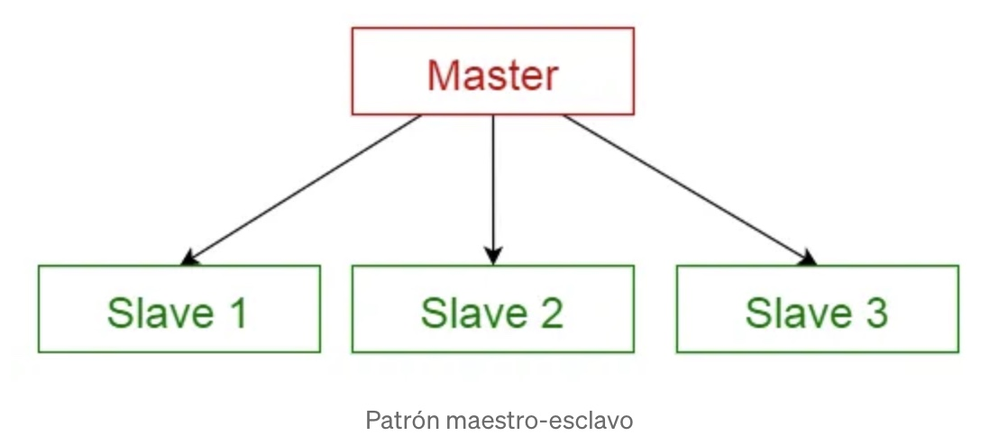

\newpage

## Resumen

Este documento presenta la caracterización de un sistema distribuido, analizando los principales retos inherentes a su diseño y ejecución. Se detalla la implementación de una arquitectura Maestro-Esclavo orientada a la detección de cadenas en un archivo, utilizando contenedores Docker para abstraer y mitigar la heterogeneidad del entorno. Asimismo, el reporte describe exhaustivamente el modelo arquitectónico propuesto, los protocolos de comunicación empleados y el modelo de fallos contemplado para la operación del clúster.

## Introducción


Un sistema distribuido es un conjunto de componentes de Hardware y Software autónomos conectados a través de una red con las siguientes características:

* La comunicación y coordinación es por paso de mensajes.
* Carecen de una referencia global de tiempo.
* No tienen memoria compartida.
* Fallos independientes.
* Concurrencia.

Al igual los sistemas distribuidos enfrentan los siguientes retos.

* Heterogeneidad
* Extensibilidad
* Seguridad
* Escalabilidad
* Tolerancia a fallos
* Transparencia
* Concurrencia
* Calidad del servicio

### Motivación
La motivación de este trabajo es la implementación de un sistema distribuido para optimizar el procesamiento de archivos de gran tamaño. Para ello se propone una arquitectura de referencia Maestro-Esclavo para paralelizar el procesamiento del archivo.

### Tecnologías Base: Docker y HPC
Para materializar este sistema y resolver los retos descritos, se emplean dos enfoques tecnológicos complementarios:

* **Contenerización con Docker:** Se utiliza como el mecanismo principal para abstraer la heterogeneidad de la infraestructura. Docker encapsula la aplicación y todas sus dependencias en contenedores ligeros, garantizando que el entorno de ejecución de los nodos sea idéntico sin importar si operan en máquinas físicas o sistemas operativos distintos.
* **Computación de Alto Rendimiento (HPC) y Pthreads:** Mientras que la red distribuye la carga general, dentro de cada contenedor se aplican principios de HPC para maximizar el uso del hardware local. Mediante el uso del estándar POSIX Threads (**Pthreads**), los nodos esclavos implementan un modelo de concurrencia de memoria compartida a nivel de CPU. Esto permite que el procesamiento del bloque de datos asignado a cada esclavo se ejecute en paralelo, aprovechando las arquitecturas multinúcleo modernas.

## Desarrollo Técnico

### Arquitectura de Referencia
El sistema se desarrollo implementando el patrón de arquitectura Maestro-Esclavo. En el que el componente maestro distribuye el trabajo entre componentes esclavos idénticos y calcula el resultado final de los resultados que devuelven los esclavos.

- **Maestro:** Distribuye los paquetes del archivo comprimidos a los esclavos a través de la red.
- **Esclavo:** Descomprime los paquetes y ejecuta el programa en C para la detección de cadenas.

{width=50% fig-align="center"}

#### Modelo de Fallos 
1. **Fallos en los Nodos Esclavos:** Se asume un modelo de fallo por detención abrupta (*fail-stop*).
2. **Fallos en el Nodo Maestro (SPOF):** Por definición, el maestro representa un Punto Único de Fallo (*Single Point of Failure - SPOF*). En el alcance de este proyecto, se asume que el maestro es un nodo **libre de fallos** (*fail-free*). Si el contenedor maestro colapsa, el procesamiento completo se detiene y requiere un reinicio manual, ya que no se implementan mecanismos de elección de líder (*leader election*) ni replicación del estado.
3. **Fallos de Red (Canales Fiables):** Dado que la comunicación inter-nodos ocurre a través de una red virtual orquestada por Docker (y apoyada en protocolos estándar como TCP/IP), se asume que no hay corrupción de mensajes, duplicación de mensajes ni pérdida silenciosa de paquetes. Sin embargo, el protocolo TCP es suceptible a fallos ya sea fallo de proceso o fallo de canal, sin capacidad de identificar de cual de los dos tipos se trata.

### Implementación del Sistema Distribuido

La materialización de la arquitectura Maestro-Esclavo se desarrolló utilizando un ecosistema contenerizado. Para el control del flujo y la persistencia del estado se integró **Redis**, operando como un intermediario o *broker* de mensajería, desacoplando completamente al maestro de los esclavos.

### Particionamiento y Coordinación (Nodo Maestro)
El Maestro fue implementado como un servicio web utilizando el framework **FastAPI** en Python. Entre sus funciones esta la transferencia de segmentos del archivo comprimidos, calcular los límites lógicos de lectura y generar tareas independientes. 

Al recibir una petición de búsqueda, el maestro realiza una consulta HTTP `HEAD` para determinar el tamaño total del archivo en bytes. Posteriormente, particiona lógicamente el archivo en segmentos de un tamaño fijo e introduce estas tareas en una cola de Redis (`search_tasks`).

El particionamiento se rige bajo la siguiente lógica para asegurar que el último fragmento no exceda los límites del archivo:

$$\text{Fin} = \min(\text{Inicio} + \text{CHUNK\_SIZE\_BYTES}, \text{Total\_Bytes})$$

El siguiente código corresponde a la implementación de Maestro en el lenguaje de Python.

``` python
import os
import time
import redis
import asyncio
from fastapi import FastAPI

app = FastAPI()
redis_host = os.getenv('REDIS_HOST', 'localhost')
r = redis.Redis(host=redis_host, port=6379, decode_responses=True)

# El maestro leerá la carpeta de chunks directamente
CHUNKS_DIR = "/app/data/chunks"

@app.post("/contar/{cadena_objetivo}")
async def contar_busqueda(cadena_objetivo: str):
    try:
        # Detectamos cuántos archivos .gz hay
        archivos_gz = [f for f in os.listdir(CHUNKS_DIR) if f.endswith('.gz')]
    except Exception as e:
        return {"error": f"No se encontraron los chunks en {CHUNKS_DIR}"}

    num_tareas = len(archivos_gz)
    print(f"\n--- INICIANDO BÚSQUEDA ---")
    print(f"Distruibuyendo {num_tareas} paquetes comprimidos.")
    
    r.set('total_matches', 0)
    r.set('tasks_completed', 0)
    r.delete('search_tasks')
    
    start_time = time.time()
    
    # Repartimos el nombre de los archivos, ya no los bytes
    for archivo in archivos_gz:
        r.rpush('search_tasks', f"{cadena_objetivo},{archivo}")
    
    r.set('total_tasks_count', num_tareas)

    while int(r.get('tasks_completed') or 0) < num_tareas:
        await asyncio.sleep(0.5)

    total = int(r.get('total_matches') or 0)
    elapsed = time.time() - start_time
    
    print(f"Búsqueda completada en {elapsed:.2f}s.")
    return {"coincidencias": total, "tiempo": elapsed, "chunks_procesados": num_tareas}

@app.get("/estado")
def obtener_estado():
    workers_activos = r.keys("worker_live:*")
    return {
        "workers_online": len(workers_activos),
        "tareas_pendientes": r.llen("search_tasks"),
        "tareas_completadas": r.get("tasks_completed") or 0
    }
```
#### Definición del Dockerfile (Maestro)

Se utiliza la imagen base python:3.10-slim para minimizar la superficie de ataque y el tamaño del contenedor. El proceso de construcción asegura que todas las dependencias necesarias para FastAPI y la comunicación con Redis estén presentes.

Configuración del Dockerfile para la creación de la imagen.

```dockerfile
FROM python:3.10-slim
WORKDIR /app
COPY requirements.txt .
RUN pip install -r requirements.txt
COPY master.py .
CMD ["uvicorn", "master:app", "--host", "0.0.0.0", "--port", "8000"]
```

### Particionamiento y Coordinación (Nodo Esclavo)
El nodo esclavo se diseñó bajo una arquitectura híbrida que separa la **gestión de tareas distribuida** de la **ejecución de cómputo intensivo**. Esta separación permite aprovechar la flexibilidad de Python para la red y la eficiencia de C para el procesamiento de alto rendimiento.

#### Orquestador de Tareas en Python (`worker.py`)
El componente en Python actúa como el cerebro logístico del esclavo. Su función primordial es la comunicación con el maestro y la preparación del entorno de datos. Sus responsabilidades incluyen:

* **Gestión del Ciclo de Vida (Heartbeats):** Implementa un hilo secundario (`threading.Thread`) que emite pulsos de vida constantes hacia Redis. Esto asegura que el Maestro tenga visibilidad en tiempo real de cuántos nodos están activos y listos para trabajar.
* **Protocolo de Extracción (Pull Model):** Utiliza una operación bloqueante (`blpop`) sobre la cola de Redis. Esto evita el uso innecesario de CPU por *polling* y garantiza que el esclavo se mantenga en espera activa hasta que el Maestro asigne una nueva tarea.
* **Adquisición de Datos vía HTTP Range Requests:** Una vez obtenida la tarea (que consiste en la cadena objetivo y el rango de bytes), el orquestador utiliza peticiones `GET` con encabezados `Range`. Esto permite descargar exclusivamente el fragmento del archivo necesario para la tarea actual.

A continuación se muestra el código worker.py:
```python 
import os
import time
import redis
import requests
import socket
import threading
import gzip
import io
import subprocess

REDIS_HOST = os.getenv('REDIS_HOST', 'redis')
BASE_URL = os.getenv('BASE_URL', 'http://fileserver/data/chunks/') 
r = redis.Redis(host=REDIS_HOST, port=6379, decode_responses=True, socket_connect_timeout=5)
worker_id = socket.gethostname()

def mandar_latido():
    while True:
        try: r.set(f"worker_live:{worker_id}", "active", ex=10)
        except: pass
        time.sleep(5)

def procesar_chunk_comprimido(target, filename):
    url = f"{BASE_URL}{filename}"
    print(f"[WORKER {worker_id}] Descargando e inyectando en RAM: {filename}")
    try:
        # 1. Descarga y descompresión
        response = requests.get(url)
        response.raise_for_status()
        with gzip.GzipFile(fileobj=io.BytesIO(response.content)) as f:
            datos_descomprimidos = f.read()
        
        # 2. Guardamos temporalmente en RAM pura (/dev/shm)
        temp_path = f"/dev/shm/{filename}.tmp"
        with open(temp_path, "wb") as tmp:
            tmp.write(datos_descomprimidos)
        
        # 3. EJECUCIÓN DEL MOTOR EN C
        resultado = subprocess.check_output(["./motor_busqueda", temp_path, target])
        matches = int(resultado.decode().strip())
        
        if matches > 0:
            r.incrby('total_matches', matches)
            print(f"¡Encontrado! {matches} matches por el motor C.")
            
        os.remove(temp_path) # Limpieza
            
    except Exception as e:
        print(f"Error en {filename}: {e}")
    
    r.incr('tasks_completed')

# --- INICIO DEL CICLO DE VIDA DEL WORKER ---

print(f"Buscando a Redis en {REDIS_HOST}...")
while True:
    try:
        r.ping()
        break
    except redis.exceptions.ConnectionError:
        time.sleep(2)

print(f"[MOTOR C ACTIVO] Worker {worker_id} listo para la batalla.")
threading.Thread(target=mandar_latido, daemon=True).start()

# Este es el bucle que faltaba y que los mantiene vivos por siempre
while True:
    tarea = r.blpop('search_tasks', timeout=0)
    if tarea:
        cadena, archivo = tarea[1].split(',')
        procesar_chunk_comprimido(cadena, archivo)
```


#### 2. Motor de Búsqueda en C (`motor_busqueda.c`)
Para cumplir con los estándares de HPC, el procesamiento real de los datos no ocurre en el intérprete de Python, sino que se delega a un binario compilado en C.

Código motor_busqueda en lenguaje C es el utilizado en primer proyecto de HPC, solo que ahora se almancena en una varible local el número de coincidencias que se encontraro en lugar de solo indicar que dicha cadena existe. : 

```C 
//Autor: Edgar Tobon Sosa
#include <stdio.h>
#include <stdlib.h>
#include <pthread.h>
#include <fcntl.h>
#include <sys/mman.h>
#include <sys/stat.h>
#include <string.h>
#include <unistd.h>

#define NUM_HILOS 20 

typedef struct {
    int id_hilo;
    char *inicio_bloque;
    size_t tamano_bloque;
    const char *cadena_buscar;
} ThreadArgs;

long total_matches = 0;
pthread_mutex_t mutex_conteo;

void* buscar_cadena(void* arg) {
    ThreadArgs *datos = (ThreadArgs*) arg;
    size_t len_cadena = strlen(datos->cadena_buscar);
    long local_count = 0;
    
    for (size_t i = 0; i < datos->tamano_bloque; i++) {
        if (i + len_cadena <= datos->tamano_bloque) {
            // Lógica de búsqueda original usando memcmp
            if (memcmp(datos->inicio_bloque + i, datos->cadena_buscar, len_cadena) == 0) {
                local_count++;
            }
        }
    }
    
    pthread_mutex_lock(&mutex_conteo);
    total_matches += local_count;
    pthread_mutex_unlock(&mutex_conteo);
    
    pthread_exit(NULL);
}

int main(int argc, char *argv[]) {
    if (argc < 3) return 1;

    const char *archivo_ruta = argv[1];
    const char *cadena = argv[2];
    
    int fd = open(archivo_ruta, O_RDONLY);
    if (fd == -1) return 1;

    struct stat sb;
    fstat(fd, &sb);
    
    // Mapeo en memoria RAM como en lectura_file_2.c
    char *mapa = mmap(NULL, sb.st_size, PROT_READ, MAP_PRIVATE, fd, 0);
    
    pthread_t hilos[NUM_HILOS];
    ThreadArgs args[NUM_HILOS];
    pthread_mutex_init(&mutex_conteo, NULL);
    
    size_t chunk_size = sb.st_size / NUM_HILOS;
    for (int i = 0; i < NUM_HILOS; i++) {
        args[i].cadena_buscar = cadena;
        args[i].inicio_bloque = mapa + (i * chunk_size);
        args[i].tamano_bloque = (i == NUM_HILOS - 1) ? (sb.st_size - (i * chunk_size)) : chunk_size;
        pthread_create(&hilos[i], NULL, buscar_cadena, (void*)&args[i]);
    }

    for (int i = 0; i < NUM_HILOS; i++) pthread_join(hilos[i], NULL);

    // Solo imprimimos el número final para que Python lo capture
    printf("%ld", total_matches);

    munmap(mapa, sb.st_size);
    close(fd);
    return 0;
}
```


#### Interfaz de Integración
La comunicación entre Python y C se realiza mediante una llamada de sistema (`subprocess` u `os.system`), donde el script de Python actúa como un *wrapper* que:

1.  Prepara el segmento del archivo.
2.  Llama al binario de C pasando los argumentos de búsqueda.
3.  Captura el código de salida o el resultado en la salida estándar (`stdout`).
4.  Reporta las coincidencias finales de forma atómica a Redis.

#### Configuración del Contenedor del Nodo Esclavo (Worker)

A diferencia del nodo maestro, el contenedor del esclavo posee una naturaleza híbrida. No solo requiere el entorno de ejecución para el orquestador en Python, sino que también necesita las herramientas de desarrollo de C para compilar el motor de búsqueda en tiempo de construcción de la imagen. 

Para lograr esto manteniendo un tamaño de imagen optimizado, se diseñó el siguiente `Dockerfile`:

```dockerfile
FROM python:3.9-slim
RUN apt-get update && apt-get install -y gcc libc6-dev  # Instalamos el compilador
WORKDIR /app
COPY requirements.txt .
RUN pip install --no-cache-dir -r requirements.txt
COPY . .
# Compilamos el motor de búsqueda modificado
RUN gcc -o motor_busqueda motor_busqueda.c -lpthread
CMD ["python", "worker.py"]
```

### Nginx

En un entorno de procesamiento distribuido, el acceso concurrente a un archivo de gran tamaño (5 GB) representa el principal cuello de botella de entrada/salida (I/O). Para resolver esto sin la sobrecarga de un Sistema de Archivos Distribuido tradicional, se integró **Nginx** como un servidor de almacenamiento estático de alto rendimiento.

El rol exclusivo de Nginx en esta topología es recibir las peticiones de los nodos esclavos y servir los bloques de bytes exactos que cada contenedor necesita procesar. Para soportar la alta concurrencia generada por los múltiples hilos de los *workers*, el servidor se configuró con directivas específicas de optimización a nivel de red y sistema operativo (`default.conf`):

```nginx
server {
    listen 80;
    server_name localhost;
    root /usr/share/nginx/html;

    location / {
        # Soporte para descargas parciales
        add_header Accept-Ranges bytes;

        # Optimizaciones de I/O y Red
        sendfile on;
        tcp_nopush on;
        tcp_nodelay on;

        keepalive_timeout 65;
    }

    access_log off;
    error_log /var/log/nginx/error.log warn;
}
```

## Pruebas y Despliegue del Sistema

### Orquestación de Servicios (Docker Compose)
Para garantizar una ejecución reproducible y mitigar la complejidad de inicializar cada componente de forma aislada, la infraestructura completa se orquestó utilizando `docker-compose`. Este enfoque permite levantar la red virtual, establecer las dependencias de inicio y montar los volúmenes de datos mediante un único archivo de configuración.

La topología del clúster define cuatro servicios principales: el intermediario de mensajes (`redis`), el servidor estático (`fileserver`), el orquestador (`master`) y los nodos de cómputo (`worker`). El nodo maestro está configurado para depender estrictamente de la disponibilidad de Redis antes de inicializarse.

```yaml
# docker-compose.yml
services:
  redis:
    image: redis:alpine
    command: redis-server --protected-mode no
    ports:
      - "0.0.0.0:6379:6379"

  fileserver:
    image: nginx:alpine
    ports:
      - "0.0.0.0:8080:80"
    volumes:
      - ./data:/usr/share/nginx/html/data:ro
      - ./nginx/default.conf:/etc/nginx/conf.d/default.conf:ro

  worker:
    build: ./worker
    shm_size: '512m'
    environment:
      - REDIS_HOST=redis
      - BASE_URL=http://fileserver/data/chunks/
      - PYTHONUNBUFFERED=1

  master:
    build: ./master
    depends_on:
      - redis
    ports:
      - "8000:8000"
    volumes:
      - ./data/chunks:/app/data/chunks:ro
    environment:
      - REDIS_HOST=redis
      - PYTHONUNBUFFERED=1
```

### Procedimiento de Ejecución y Escalabilidad

El diseño del sistema permite escalar la capacidad de cómputo de manera dinámica. Para inicializar el clúster en una máquina principal (Máquina A) con un número específico de esclavos, se utiliza el parámetro --scale

```docker
# Levantar el entorno con 2 nodos esclavos locales
docker compose up --build --scale worker=2
```
Es posible conectar nodos adicionales desde una Máquina B remota, apuntando a la IP del servidor maestro

```docker
# Conectar 10 nodos esclavos adicionales desde una máquina remota
docker compose up --build --scale worker_remoto=10
```

Una vez que los workers están en espera activa, la prueba del sistema se dispara inyectando una solicitud HTTP POST al puerto expuesto por el maestro mediante la herramienta curl:

```docker
# Iniciar la búsqueda distribuida
curl -X POST http://localhost:8000/contar/cadena-a-buscar
```

### Resultados

Al finalizar la ejecución, el sistema imprimió en la consola el tiempo total de procesamiento. De acuerdo con la imagen capturada, la ejecución se completó en un tiempo de 307 segundos. Este tiempo depende de la red en la que te encuentres y el tipo de conexión (ethernet o wifi).

## Discusión de Resultados

 Si bien la adopción de contenedores resolvió el problema de la heterogeneidad, introdujo sobrecargas (*overhead*) inherentes a la virtualización de red.

1.  **Ancho de Banda de I/O:** Aunque Nginx con `sendfile` optimizó la entrega, servir decenas de bloques concurrentes de 100 MB satura la tarjeta de red del nodo anfitrión.
2.  **Latencia del Intermediario:** Redis maneja eficientemente las colas en memoria, pero el tráfico constante de *heartbeats* y actualizaciones atómicas de contadores incrementa la latencia global conforme se añaden más nodos esclavos.


## Conclusiones

Este proyecto demostró exitosamente la viabilidad de utilizar tecnologías de contenerización para desplegar aplicaciones de Computación de Alto Rendimiento en entornos heterogéneos. 

* La arquitectura **Maestro-Esclavo** desacoplada mediante **Redis** probó ser altamente escalable y tolerante a fallos a nivel de nodo trabajador.
* El diseño híbrido del esclavo, que delega la orquestación de red a **Python** y el cómputo intensivo a rutinas optimizadas en **C (Pthreads)**, permitió maximizar el uso de CPU local sin sacrificar la mantenibilidad del código.
* El uso de **Docker** garantizó un entorno de ejecución idéntico (incluyendo el compilador `gcc` y las librerías dinámicas), mitigando completamente los riesgos de incompatibilidad entre sistemas operativos subyacentes.

## Disponibilidad del Código

El código fuente completo de este proyecto ha sido publicado en github. El entorno contiene toda la implementación del sistema distribuido, incluyendo el orquestador del nodo maestro (FastAPI), el motor de búsqueda de alto rendimiento (C/Pthreads), la gestión del intermediario (Redis) y los archivos de configuración para la contenerización (`Dockerfile` y `docker-compose.yml`).

El repositorio, puede ser consultado en el siguiente enlace:

* **Repositorio de GitHub (Rama *Development*):** [https://github.com/MoY8462/high-performance-computing-II/tree/development](https://github.com/MoY8462/high-performance-computing-II/tree/development)