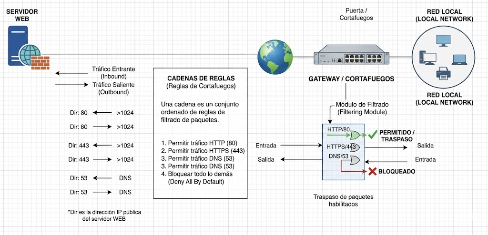

\newpage

## Networking and Internetworking

### Introduction

  We shall refer to the collection of hardware and software components that provide the communication facilities for a distributed system as a **communication subsytem**. The computers and other devices that use the network for communication proporses are referred to as **host.** The term **node** is used to refer to any computer or switching device attached to a network.

  The internet is a single communication subsystem providing communication between all of the hosts that are connected to it. The internet is constructed from many subnets. A subnet is a unit of routing; its a collection of nodes that all can be reached on the same physical network.

### Network issues for distributed systems

  The network performance parameters that are of primary interest for our purposes are those affecting the speed with which individual messages can be transferred between two inteconnected computers. These are the latency and the point-to-point data transfer rate:

  * **Latency** is the delay that occurs after a send operation is executed and before data starts to arrive at the destination computer.

  * **Data transfer rate** is the speed at which data can be transferred between two computers in the network once transmission has begun, usually quoted in bits per second.

  The performance of networks deteriorates in conditions of overload, whe are too many messages in the network at the same time.

#### Scalability

For simple client-server applications such as the Web, we would expect future traffic to grow at least in proportion to the number of active users.

#### Reliability

Many applications are able to recover from communication failures and hence do not require guaranteed error-free communication. The end-to-end argument further supports the view that the communication subsytem need not provide totally error-free communication; the detection of cummunication errors and their correction is often best performed by application-level software.

#### Security

The first level of defence adopted by most organizations is to protect its netwok and the computers attached to them with a firewall. A firewall crates a protection boundary between the organization intranet and the rest of the internet. The propourse of the firewall is to protect the resources in all of the computers inside the organization form access by external users of processes and to control the use of resources outside the firewall by users inside the organizaiton.

A firewall runs on a gateway - a computer that stands at the network entry point to an organization's intranet.

#### Quality of service

We defined quality of services as including the ability to meet deadlines when transmitting and processing streams of real-time multimedia data. Applications that transmit multimedia data require guaranteed bandwidth and bounded latencies for the communication channels that the use.

## Network principles

The basis for all computers networks is the packet-switching technique first developed in 1960s. This enable data packets addressed to different destinations to share a single communication link. Packets are queued in a buffer and transmitted when the link is available.

## Firewall

Vamos a hacer cortafuegos.

Por el protocolo TPC/IP podemos filtrar.

* Direcciones IP.
* Redes
* Servicios
* Inicios de sesión

Se deben cerrar todos los servicios, redes, direcciones, se bloque todo y se abre lo que se requiera.

Para que haya red necesitamos.

* Servidor de nombres (53)
* SSH (22)
* Web (80)
* Web seguro (443)

Este diagrama ilustra la arquitectura de seguridad y el flujo de tráfico entre un servidor web público, el internet y una red local privada, mediado por un cortafuegos (firewall) configurado con reglas específicas.

### Componentes principales

- **Servidor Web:** Representa el servidor que aloja al sitio web o a la aplicación. Es el destino del tráfico entrante de los clientes y el origen del tráfico saliente. El diagrama asume que "Dir" corresponde a la dirección IP pública de este servidor.

- **Internet:** Red pública externa donde provienen los usuarios.

- **GATEWAY/Cortafuegos (Puerta):** Es el dispositivo central de seguridad. Actúa como una puerta que inspecciona todo el tráfico que entra y sale de la red local. Su función es permitir o bloquear paquetes basandose en un conjunto de reglas.

- **Red Local:** Representa la red interna privada.

### Lógica del flujo de tráfico y Relgas

El diagrama detalla como se gestiona el tráfico para tres protocoles comunes: HTTP, HTTPS, DNS.

1. **Flujo de tráfico (Entrante vs Saliente):**

- Tráfico entrante: Se refiere a las peticiones que se originan fuera y buscan acceder al servidor web. Por ejemplo, un usuario en internet intentando abrir la página web.

- Tráfico saliente: Son las respuestas que el servidor web envía de vuelta a los usuarios externos.

2. **Cadena de reglas**

La Tabla es el núcleo de la explicación. Define extactamente que combinaciones de puertos estás permitidos en cada sentido.

- **Puertos de escucha:** Los servidores web escuchan peticiones en puertos fijos y conocidos (80 para HTTP, 443 para HTTPS).

- **Puertos efimeros/dinámicos:** Cuando un cliente o servidor inicia una conexión, el sistema operativo le asigna un puerto de origen aleatorio en el rango alto (normalmente 1024 al 655335). Estos se conocen como puertos efimeros.

| Protocolo | Sentido | Puerto de Origen | Puerto de Destino | Descripción |
| :--- | :--- | :--- | :--- | :--- |
| **HTTP** | **Entrante** | >1024 (Cliente) | **80** (Servidor) | Un usuario externo (con puerto alto) solicita acceso a la web en el puerto 80 del servidor. |
| **HTTP** | **Saliente** | **80** (Servidor) | >1024 (Cliente) | El servidor responde desde su puerto 80 hacia el puerto alto que el cliente abrió para la conexión. |
| **HTTPS** | **Entrante** | >1024 (Cliente) | **443** (Servidor) | Similar a HTTP, pero para conexiones seguras cifradas. |
| **HTTPS** | **Saliente** | **443** (Servidor) | >1024 (Cliente) | El servidor responde de forma segura desde su puerto 443. |
| **DNS** | **Entrante** | >1024 (Cliente) | **53** (Servidor) | Un cliente externo solicita traducir un nombre de dominio en una IP, usando el puerto 53. |
| **DNS** | **Saliente** | **53** (Servidor) | >1024 (Cliente) | El servidor DNS responde con la dirección IP correspondiente. |

: Análisis de la Tabla de Reglas de Cortafuegos {#tbl-reglas-cortafuegos}

3. **Procesamiento en el cortafuegos:**

Esta sección visualiza lo que ocurre dentro del dispositivo gateway.

- Filtrado: El cortafuegos actua como embudo. Compara cada paquete con la cadena de Reglas descrita en la tabla.

- Forwarding: Si el paquete cumple con una regla permitida, el cortafuegos lo deja pasar y lo reenvia a su destino (la Red Local o internet). Esto es el "traspaso de paqute habilitados."

- Blocked: Si el paquete no cumple con ninguna regla permitida o va en contra de una regla de seguridad, el cortafuegos lo detiene y lo descarta.