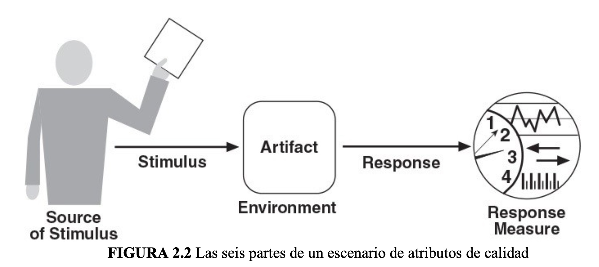
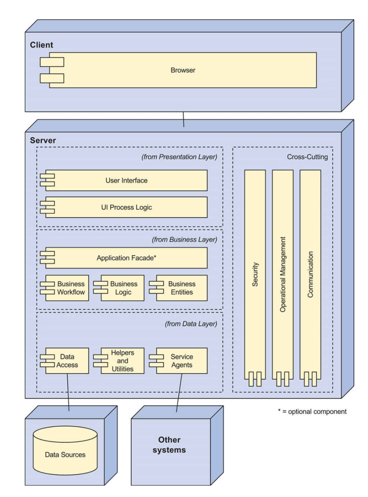
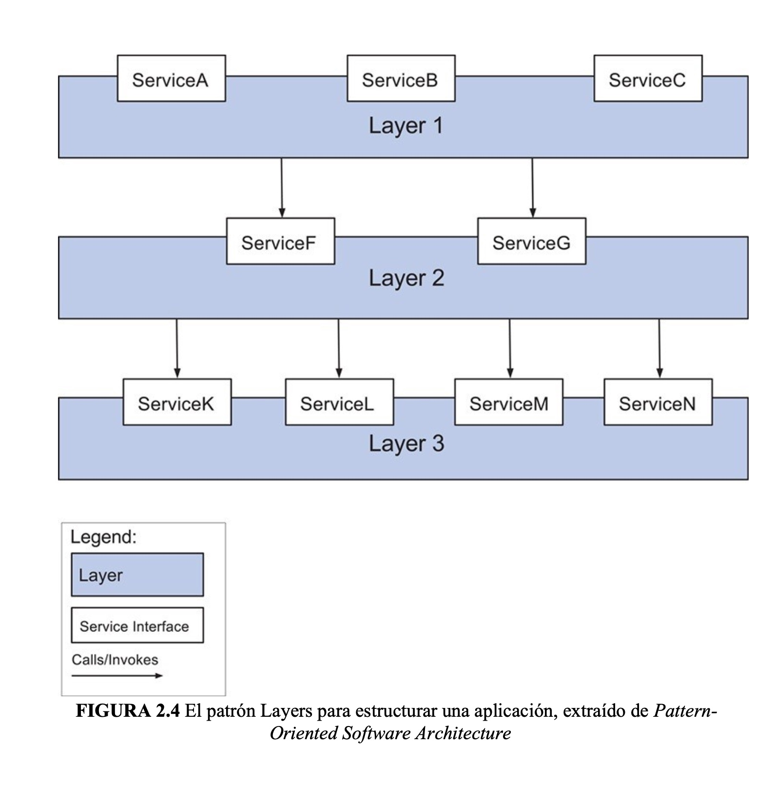
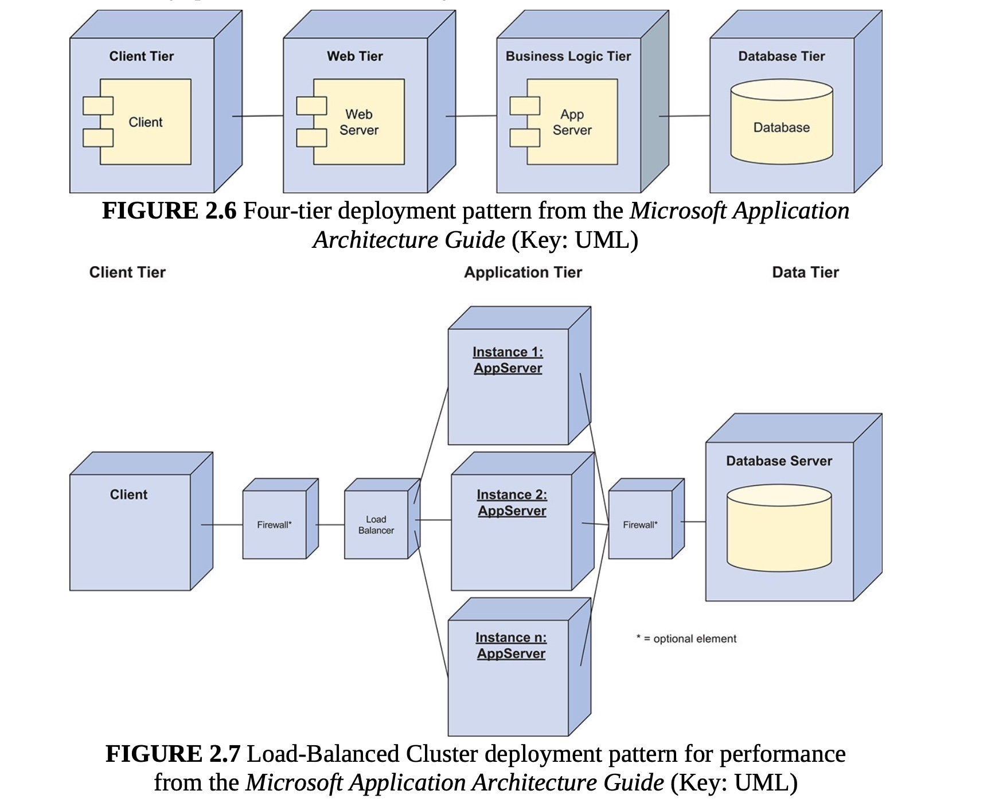

# El diseño en general
Diseñar significa tomar desiciones para alcanzar objetivos y satisfacer requisitos y restricciones. 

¿Es dificil el diseño? El diseño novedoso es dificil, afortunadamente, la mayoría de diseños nos es novedoso, porque la mayoría de las veces nuestros requisitos támpoco lo son.

La buena noticia es que existen numerosos diseños y fragmentos de diseño probados, o bloques de construcción llamados **conceptos de diseño,** que pueden reutilizarse y combinarse para alcanzar estos objetivos de forma fiable.

# Diseño en la arquitectura de software
En el diseño arquitectónico, tomamos desiciones para transformar nuestro propósito de diseño, requisitos, restricciones y preocupaciones arquitectónicas (**drivers**) en estructuras.

La elección de una arquitectura de referencia concreta puede proporcionar una buena base para alcanzar sus objetivos de latencia y mantener a su plantilla empleada, ya que esta familiarizada con esa arquitectura de referencia y su pila tecnológica de apoyo. Pero esta elección puede no ayudarle a entrar en un nuevo mercado, como por ejemplo el de los juegos para móviles.

En general, al diseñar, un cambio en alguna estructura para lograr un atributo de calidad tendrá efectos negativos en otros atributos de calidad. Por lo tanto el trabajo de un arquitecto no consisten en encontrar una solución óptima, sino más bien en satisfacer, buscando entre un espacio potencialmente amplio de alternativas de diseño y decisiones hasta encontrar una solución aceptable.

# Diseño arquitectónico
Grady Booch a dicho "Toda arquitectura es diseño, pero no todo diseño es arquitectura". Una decisión es arquitectónica si tiene consecuencias no locales y esas consecuencias son importantes para el logro de un driver arquitectónico.

# Diseño de la interacción entre elementos
El diseño arquitectónico generalmente da como resultado la identificación de solo un subcojunto de los elementos que forman parte de la estructura del sistema. Esto es de esperar porque durante, durante el diseño arquitectónico incial, el arquitecto se centrará en la funcionalidad principal del sistema.

Cada sistema tiene muchos casos de uso, además de los principales, que deben satisfacerse. Los elementos que respaldan estos casos de uso no principales y sus interfaces se identifican como parte de lo que denominamos **diseño de interacción de elementos.** Este nivel diseño suele seguir al diseño arquitectónico. Estos elementos pueden ser unidades de trabajo (módulos) asignadas a una persona o a un equipo.

# Diseño interno de elementos
El diseño interno de elementos, sigue al diseño de la interacción entre elementos. En este nivel de diseño, se establece el interior de los elementos identificados en el nivel de diseño anterior, con el fin de satisfacer la interfaz del elemento.

Las decisiones arquitectónicos pueden tomarse y se toman en los tres niveles de diseño.

# ¿Por qué es importante el diseño arquitectónico?
No tomar ciertas decisiones de diseño, o no tomarlas con suficente antelación, tiene un coste muy elevado para un proyecto. En una fase temprana, una arquitectura inicial es fundamental para propuestas de proyectos. Incluso en esta fase temprana, una arquitectura determinará los enfoques claves para lograr los impulsores arquitectónicos, la estructura general de desglose de trabajo y la elección de herramientas, habilidades y tecnologías necesarias para realizar el sistema.

# Factores arquitectónicos
Los drivers incluyen.

* El propósito del diseño.
* Lo atributos de calidad.
* La funcionalidad principal.
* Las preocupaciones arquitectónicas.
* Las restricciones.

# Proposito del diseño
En primer lugar, debe tener claro el objetivo del diseño que desea lograr.
¿Cuándo y por qué está realizando el diseño arquitectónico? ¿Cuáles son los objetivos empresariales que más preocupan a la organización en este momento?

* Es posible que este realizando el diseño de la arquitectura como parte de una propuesta de proyecto.

* Es posible que este realizando el diseño de una arquitectura como parte del proceso de creación de un prototipo exploratorio.

* Es posible que este realizando el diseño de una arquitectura durante el desarrollo.

# Atributos de calidad
Los atributos de calidad se definen como propiedades medibles o comproblables de un sistema que se utilizan para indicar en que medida el sistema satisface las necesidades de las partes interesadas.

Entre los drivers, los atributos de calidad son los que más influyen en la arquitectura. Las decisiones críticas que se toman al realizar el diseño arquitectónico determinan, en gran medida, las formas en que el sistema cumplira o no los atributos de calidad.

Dada su importancia, debe preocuparse por obtener, especificar, priorizar y validar los atributos de calidad.

Una de las mejores maneras de debatir, documentar y priorizar los requisitos de atributos de calidad es mediante un conjunto de escenarios. Un escenario, en su forma más básica, describe la respuesta del sistema a algun estimulo. ¿Por qué los escenarios de atributos de calidad son el mejor enfoque? !Porque todos los demás son peores! Se puede perder una cantidad infinita de tiempo definiendo términos como "rendimiento", "modificabilidad" o "configurabilidad", ya que estas deciesiones tienden a arrojar poca lus sobre el sistema real. No tiene sentido decir que un sistema será modificable, porque todos los sistemas son modificables con respecto a unos cambios y no modificables con respecto a otros. Sin embargo se puede especificar la medida de respuesta de modificabilidad que se desea lograr en respuesta a una solicitud de cambio específica.

Un escenario de atributo de calidad es una breve descripción de como se requiere que un sistema responda a algún estímulo. Un escenario de atributo de calidad  completo añade otras de partes:

* La fuente del estímulo.
* El artefacto afectado.
* Entorno.

# Funcionalidad principal
La funcionalidad es la capacidad del sistema para realizar el trabajo para el que fue diseñado. A diferencia de los atributos de calidad, la forma en que está estructurado el sistema no suele influir en la funcionalidad. 

Al diseñar una arquitectura, es necesario tener en cuenta al menos la funcionalidad principal. La funcionalidad principal se define como normalmente como aquella funcionalidad que es fundamental para alcanzar los objetivos empresariales que motivan el desarrollo del sistema.

Hay dos razones importantes por las que es necesario tener en cuenta la funcionalidad principal al diseñar una arquitectura. 

1. Es necesario pensar en como se asignará la funcionalidad a los elementos (normalemente módulos) para promover la modificabilidad o la reutilización, y también para planificar las asignaciones de trabajo.

2. Algunos escenarios de atributos de calidad están directamente asociados con la funcionalidad principal del sistema.

# Consideraciones arquitectónicas
Las consideraciones arquitectónicas abarcan aspectos adicionales que deben tenerse en cuenta como parte del diseño arquitectónico. Existen varios tipos diferentes de consideraciones.

1. **Consideraciones generales:** Se trata de cuestiones "amplias" que se abordan la crear la arquitectura, como el establecimiento de una estructura general del sistema, la asignación de funcionalidades a los módulos, etc.

2. **Preocupaciones específicas:** Custiones internas del sistema más detalladas como la autenticación, gestión de excepciones, etc. 

3. **Requisitos internos:** Los requisitos internos puede abordar aspectos que facilitan el desarrollo, la implementación, el funcionamiento o el mantenimiento del sistema.

# Restricciones
Una restricción es una decisión sobre la que usted, como arquitecto, tiene poco o ningún control.

# Conceptos de diseño: los bloques de construcción para crear estructuras
Al comienzo de cualquier actividad de diseño, el espacio de posibilidades puede parecer incriblemente enorme y complejo. Sin embargo, hay algo que puede ayudarnos. La comunidad de arquitectura de software a creado y desarrollado un conjunto de principios de diseño generalmente aceptados que pueden guiarnos para crear diseños de alta calidad con resultados predecibles.

Por ejemplo, algunos de los principio de diseño bien documentados están orientados al logro de atributos de calidad específicos:

* Para ayudar a lograr una alta modificabilidad, se debe buscar una buena modularidad, lo que significa una alta cohesión y un bajo acoplamiento.

* Para ayudar a lograr una alta disponibilidad, evite tener un único punto de fallo.

* Para ayudar a lograr la escalabilidad, evite tener límites codificados para los recursos críticos.

* Para ayudar a lograr la seguridad, limite los puntos de acceso a los recursos críticos.

* Para ayudar a lograr la capacidad de prueba, externalice el estado.

A las realizaciónes reutilizables las llamamos **conceptos de diseño** y son lo bloques de construcción a partir de los cuales se crean estructuras que conforman la arquitectura.

Existen diferentes tipos de concepto de diseño, discutiremos:

* Arquitecturas de referencia.
* Patrones de implementación.
* Patrónes arquitectónicos.

# Arquitecturas de referencia
Las arquitecturas de referencia son planos que proporcionan una estructura lógica general para tipo concretos de aplicaciones. Una arquitectura de referencia es un modelo de referencia mapeado en uno o más patrones arquitectónicos.

Cuando se adopta una arquitectura de referencia para una aplicación, también se adopta un conjunto de cuestiones que deben abordarse durante el diseño. Es posible que no exista un requisito explícito relacionado con las comunicaciones o la seguridad, pero el hecho de que estos elementos formen parte de la arquitectura de referencia obliga a tomar decisiones de diseño al respecto.

# Patrones de diseño arquitectónico
Los patrones de diseño son soluciones conceptuales a problema de diseño recurrentes que existen en un contexto definido. Se considera que un patrón es arquitectónico cuando su uso influye directa y sustancialmente en la satisfacción de algunos drivers.

Aunque las arquitecturas de referencia pueden considerarse un tipo de patrón, preferimos considerarlas por separado debido al importante papel que desempeñan en la estructuración de una aplicación y porque están directamente relacionadas con las pilas tecnológicas.

# Patrones de implementación
Otro tipo de patrón que hay que considerar por separado son los patrones de implementación. Estos patrones proporcionan modelos sobre como estructurar fisicamente el sistema para implementarlos. Algunos patrones de implementación, son útiles para establecer una estructura física inicial del sistema en términos de capas (nodos físicos). Los patrones de implementación más especializados, como el cluster con equilibrio de capas, se utiliza para satisfacer atributos de calidad como la disponibilidad, el rendimiento y la seguridad. 

En general, la estructura incial del sistema se obtiene asignando los elementos lógicos que se obtienen de las arquitecturas de referencia (y otros patrones) a los elementos físicos definidos por los patrones de implementación.
